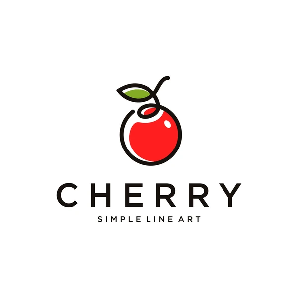

# cherry [](https://npmjs.com/package/@sunny-117/cherry)

简体中文 | <a href="./README-en.md">English</a>



Cherry 是一个轻量级且高效的 JavaScript 打包工具，专为现代 Web 应用的快速构建和打包而设计。通过简单而强大的工作流程，致力于提供最佳的性能和开发体验。

## 特性

📦️ 轻量级：Cherry 注重最小化打包工具的体积，确保快速启动和加载时间。

🔧 简单配置：提供简洁直观的配置选项，轻松自定义和调整项目的打包过程。

🔥 tree-shaking：通过静态分析代码，自动移除未使用的代码，减小最终打包文件的大小。

## 安装

```bash
pnpm i @sunny-117/cherry -D
```

## 使用

```ts
import { dirname, resolve } from 'node:path'
import { fileURLToPath } from 'node:url'
import { cherry } from '@sunny-117/cherry'

const __filename = fileURLToPath(import.meta.url)
const __dirname = dirname(__filename)

const entry = resolve(__dirname, './msg.js')
cherry(entry, resolve(__dirname, '../bundle.js'))
```

查看[示例](https://github.com/Sunny-117/cherry/blob/main/playground/src/index.js)了解更多详情。

## 开源协议

[MIT](./LICENSE) License © 2024 [Sunny-117](https://github.com/sunny-117)
